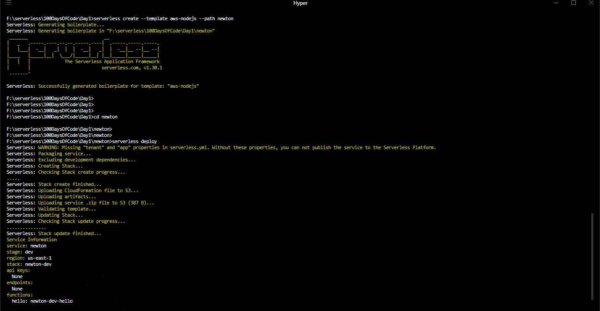

# Learning serverless framework

Serverless framework is used to deploy the serverless application with ease.
It is a wrap around cloudformation to create AWS resources.
It is cloud-agonistic and infrastructure as a code platform.

Today learned about basics of various components of serverless framework.

- functions [ peice of code run which runs based on events ]
- events [ trigger for function call ]
- resources [ Other resources with which functions interact for various tasks like databases,payment gateways,MQ ]
- services [ collection of functions, resources and events ]
- plugins [ extends the functionality of serverless ]

### Installation of serverless

First we have to install nodejs latest version, as framework developed based on nodejs runtime.
Then install serverless using npm package manager.

`npm install serverless -g`

### First service deployment

Ensure AWS CLI already configured with default profile.
then use serverless template to create a service which has some biolerplate code.

`serverless create --template aws-nodejs --path newton`
`cd newton`
`serverless deploy -v`

It will create sample welcome serverless function in AWS.
